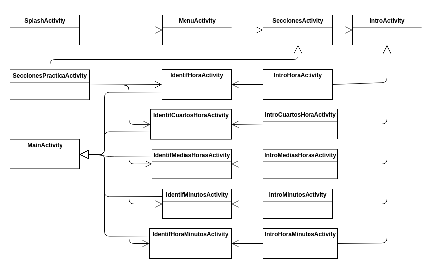

# fiuba-hora [](https://travis-ci.org/ProyectoDane/fiuba-hora)

## General
Este proyecto esta escrito en Kotlin 1.2.51 utilizando la SDK de Android versión 26.1.0. 
Ya que el destino de la aplicación es su ejecución en tablets, actualmente está siendo probada en un emulador de una tablet Nexus 9.

## Arquitectura de la aplicación

### Diagrama de clases de la aplicación.


### Diagrama de secuencia de la aplicación.


## Integración continua
Travis CI es la herramienta utilizada en este proyecto para la integración continua, y generación de releases automáticos.
La configuración de los pasos a ejecutar se encuentra en el archivo `.travis.yml`.
Para acceder al estado y el detalle de los builds se debe acceder a la plataforma de Travis en https://travis-ci.com/ con el usuario de Github que tiene acceso a este repositorio (es decir, se debe ser colaborador en este repositorio para poder acceder con las mismas credenciales de Github).


## Como generar un nuevo relase apk firmado
Para subir un apk de la aplicación a Google Play se necesita que esté firmado.
Para poder firmar un apk primero se debe crear una keystore para los releases.

### Instrucciones para crear keystore y generar apk firmado desde Android studio
https://developer.android.com/studio/publish/app-signing?hl=es-419#sign-apk

### Instrucciones para crear keystore y generar apk firmado desde la linea de comandos
https://developer.android.com/studio/publish/app-signing?hl=es-419#signing-manually

### Proceso automatico de release
Una vez generada la keystore

En el archivo `gradle.properties`, llenar los campos
```
RELEASE_STORE_FILE=
RELEASE_STORE_PASSWORD=
RELEASE_KEY_ALIAS=
RELEASE_KEY_PASSWORD=
```
con los valores que se usaron para generar la keystore.

Luego estando parado en el directorio raiz de la aplicación, ejecutar
```./release_new_version.sh```

Este script realiza:
- el commit de los ultimos cambios
- el push de dichos cambios al branch del repositorio
- la generación del tag para el release a partir de la version de la aplicación (en `build.gradle`, campo `versionName`)
- el push del tag al repositorio para que Travis.ci genere el apk firmado y lo adjunte al nuevo release en el repositorio.
